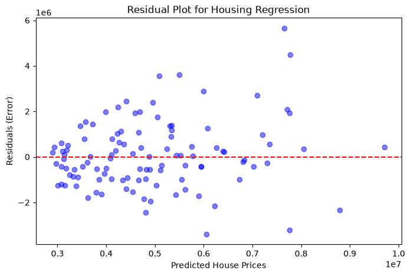

# B.Y.T.E AI internship Task 6 — Linear Regression: House Price Prediction
**The "Housing Crash" Simulator**

## Project Overview
This project deploys a multiple linear regression model to predict real estate prices based on property characteristics. It includes a live "Housing Crash" simulator deployed via PyScript, allowing users to dynamically adjust interest rates and visualize the negative economic impact on their property's valuation in real-time.

**Author:** Maria Rafik Saeed

## Dataset & Preprocessing
* **Source:** `Housing.csv`
* **Features Selected:** The model was trained on the top 5 continuous numerical features to optimize for a streamlined web interface: `area`, `bedrooms`, `bathrooms`, `stories`, and `parking`.
* **Preprocessing:** 
  * Isolated the target variable (`price`).
  * Performed an 80/20 Train/Test split (`random_state=42`) to ensure the model is evaluated on unseen data.
  * Suppressed irrelevant categorical data to focus strictly on numerical baseline regression.

## Model Performance & Evaluation Metrics
The Linear Regression model achieved the following metrics on the 20% test data:
* **R-Squared ($R^2$):** 56.0% (The model explains 56% of the variance in house prices using just 5 features).
* **Mean Absolute Error (MAE):** ~$1,113,007 (The average deviation from the actual market price).

### Residual Analysis

The residual plot maps the model's predicted house prices against the actual errors (residuals). The data points are relatively centered around the zero-error line (red dashed line), indicating the model does not heavily overpredict or underpredict on average. However, heteroscedasticity is present: as the predicted house prices increase (moving right on the x-axis), the spread of the residuals widens, meaning the model is less accurate at predicting extremely expensive luxury homes compared to standard homes.

## Sample Predictions vs. Actual Values
*Note: These are 5 random samples extracted from the test split.*

| Actual Price | Predicted Price | Difference (Error) |
|--------------|-----------------|--------------------|
| $4,060,000   | $6,220,042      | -$2,160,042        |
| $6,650,000   | $6,421,245      | $228,755           |
| $3,710,000   | $3,209,272      | $500,728           |
| $6,440,000   | $4,242,892      | $2,197,108         |
| $2,800,000   | $3,350,592      | -$550,592          |

### Model Limitations & Insights
While the model successfully executes multiple linear regression, the Mean Absolute Error (MAE) and individual prediction differences are notably high (sometimes exceeding $1M–$2M). This is an expected limitation of the current dataset. The model evaluates only 5 physical characteristics (area, rooms, parking) and lacks access to the most critical real estate value drivers: neighborhood location, property age, and condition. This simulator serves as a mathematical baseline but highlights the necessity of geographic data for highly accurate real-world property valuation.

## Artifacts & Deliverables Included
* `reg.py`: The core regression training and CLI prediction script.
* `housing_model.pkl`: The serialized regression model.
* `residual_plot.png`: The residual plot visualization.
* `index.html`: The PyScript Vercel web wrapper containing the "Interest Rate" interactive simulator.

## Reproduction Instructions
1. Clone this repository and ensure `Housing.csv` and `reg.py` are in the same directory.
2. Run `python reg.py` in your terminal.
3. Follow the terminal prompt to enter a comma-separated list of metrics (e.g., `7420, 4, 2, 3, 2`).
4. To view the web simulator, host the directory on Vercel or open `index.html` via a local live server.
